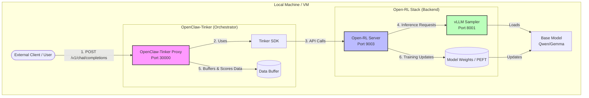

# Friction Log - Open-RL & OpenClaw-Tinker Setup

This log documents the difficulties, confusion, and issues encountered during the process of setting up the Open-RL infrastructure and running the `openclaw-tinker` project on a local VM.

**Goal**: Set up the Open-RL infrastructure for the `openclaw-tinker` project to enable Reinforcement Learning training using the Tinker API on a local VM.

## Architecture Overview

Here is a diagram illustrating the setup and data flow:



### Flow Description:
1.  **User/Client** sends a prompt to the **OpenClaw-Tinker Proxy** (acting as an OpenAI-compatible endpoint).
2.  The Proxy uses the **Tinker SDK** to communicate with the backend.
3.  The SDK sends requests to the **Open-RL Server** (the API gateway).
4.  The Open-RL Server forwards inference requests to the **vLLM Sampler** to generate text.
5.  The Proxy receives the response, scores it, and [stores it in a queue](https://github.com/Gen-Verse/OpenClaw-RL/blob/ffdebf1d46883394308fb4d8659a62794c38d43b/openclaw-tinker/api_server.py#L649). This happens for each request individually.
6.  Once the queue accumulates enough samples to reach the [batch size](../../../OpenClaw-RL/openclaw-tinker/config.py#L34), the system pulls them all out to perform a training step, updating the **Model Weights** in storage.
7.  **Continuous Learning Loop**: The Open-RL Server pushes the newly updated weights back to the **vLLM Sampler**. The next batch of requests (starting again at Step 1) will now be served by this smarter model, creating an ongoing cycle of improvement.


## 1. Environment Variable "Trap" with vLLM Override

*   **Friction**: The local setup guide for Gemma 4 required setting `export VLLM_ARCHITECTURE_OVERRIDE=Gemma4ForCausalLM`. When switching to the Qwen model, forgetting to unset this variable caused vLLM to crash with a cryptic `AttributeError: 'Qwen3Config' object has no attribute 'hidden_activation'`.
*   **Impact**: Wasted time troubleshooting why Qwen wouldn't load, thinking it was a model compatibility issue rather than a stale environment variable.
*   **Suggestion**: The setup scripts or documentation should strongly emphasize unsetting or scoping these overrides to specific runs.

## 2. Disk Space Exhaustion during Installation & Compilation

*   **Friction**: The VM disk ran out of space multiple times. First, during the installation of large wheels like `flashinfer-cubin` (which is a dependency of `sglang`), and second, when the Triton compiler attempted to write cache files during model execution.
*   **Impact**: Repeated failed installations and runtime crashes with `No space left on device` (os error 28).
*   **Suggestion**: Document the total disk space required for a full local setup (including large model caches and compiler caches). Suggest cleaning the `uv` cache aggressively or sizing VMs with larger disks (at least 50GB+) up front.

## 3. Missing `adapter_config.json` from PEFT Save

*   **Friction**: The PEFT library's `save_pretrained` method saved the `adapter_model.safetensors` file but failed to generate the corresponding `adapter_config.json` in the expected directory. This caused the vLLM sampler to fail with a `LoRAAdapterNotFoundError` when it tried to load the adapter.
*   **Impact**: Blocked the core functionality of sampling from the trained model.
*   **Resolution**: We had to manually create the JSON file as a workaround and later proposed code modifications to handle this automatically.

## 4. Undocumented `tinker` SDK Dependency

*   **Friction**: The `openclaw-tinker` project imported `tinker`, but this package was not listed anywhere in the `requirements.txt` file provided in the repository.
*   **Impact**: Caused `ModuleNotFoundError: No module named 'tinker'` when attempting to run the script.
*   **Resolution**: We had to dig into the `open-rl` repository's examples to find that `tinker==0.18.2` was the expected version to install.

## 5. `uv` Incompatibility with Editable Git Requirements

*   **Friction**: The `requirements.txt` file contained an editable git install (`-e git+https://github.com/...`). The `uv` tool, which was recommended for setup, failed with `error: Unsupported editable requirement in requirements.txt`.
*   **Impact**: Blocked the smooth "one-command" setup flow that `uv` usually provides.
*   **Resolution**: Had to either switch back to standard `pip` (which hit OS environment blocks) or manually edit the file to remove the `-e` flag.

## 6. Multi-Turn Dependency for Sample Collection

*   **Friction**: The `combine` method in `openclaw-tinker` quietly dropped samples if they did not have a `next_state` (i.e., if the session was closed on the first turn).
*   **Impact**: Confusion as to why sending a simple `curl` request resulted in a successful response but the server's rollout queue remained at `0/16` (where 16 is the `batch_size` specified in your command line argument, overriding the default of 4 in [config.py](../../../OpenClaw-RL/openclaw-tinker/config.py#L34)).
*   **Insight**: Learned that in this specific RL implementation, Turn N is only evaluated and committed to the training batch when Turn N+1 is received. This is a non-obvious behavior that should be explicitly documented for new users.

## 7. Minimal Working Dependencies

To bypass the issues with the full `requirements.txt` (like disk space and compilation errors), we identified that `openclaw-tinker` can run with a minimal set of packages.

Here are the packages we installed to make it work:
- `fastapi` (for the API server)
- `uvicorn` (to run the API server)
- `transformers` (for tokenization)
- `torch` (for data formatting)
- `tinker==0.18.2` (SDK, found in `open-rl/examples/pyproject.toml`)
- `httpx` (needed for the Google Chat bridge)

Command used:
```bash
uv pip install fastapi uvicorn transformers torch httpx tinker==0.18.2
```
