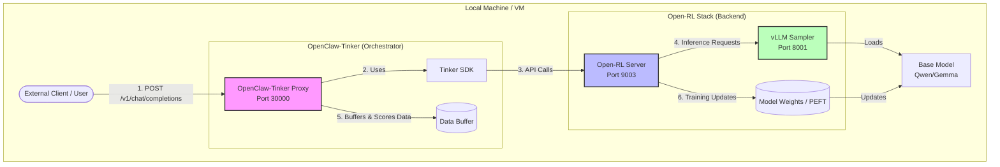

# Comprehensive Guide: Self-Hosted Continuous Learning Stack

This guide walks you through setting up the complete stack (**Open-RL**, **OpenClaw-Tinker**, and **OpenClaw**) to enable **observing and verifying whether continuous learning actually works in a self-hosted environment** on a fresh Linux VM with sufficient GPU capacity.

## Architecture Overview

Here is a diagram illustrating the setup and data flow:



### Flow Description:
1.  **User/Client** sends a prompt to the **OpenClaw-Tinker Proxy** (acting as an OpenAI-compatible endpoint).
2.  The Proxy uses the **Tinker SDK** to communicate with the backend.
3.  The SDK sends requests to the **Open-RL Server** (the API gateway).
4.  The Open-RL Server forwards inference requests to the **vLLM Sampler** to generate text.
5.  The Proxy receives the response, scores it, and [stores it in a queue](https://github.com/Gen-Verse/OpenClaw-RL/blob/ffdebf1d46883394308fb4d8659a62794c38d43b/openclaw-tinker/api_server.py#L649). This happens for each request individually.
6.  Once the queue accumulates enough samples to reach the [batch size](../../../OpenClaw-RL/openclaw-tinker/config.py#L34), the system pulls them all out to perform a training step, updating the **Model Weights** in storage.
7.  **Continuous Learning Loop**: The Open-RL Server pushes the newly updated weights back to the **vLLM Sampler**. The next batch of requests (starting again at Step 1) will now be served by this smarter model, creating an ongoing cycle of improvement.


<details>
<summary><b>Concept: How the Continuous Learning Loop Works</b></summary>

Here is the step-by-step cycle of how the system improves itself over time:

1. **You Chat (The Experience)**: You send a message on WhatsApp. The model (Student) generates a response and sends it back to you.
2. **The System Waits (The Buffering)**: The system cannot score your message yet. It puts it in a temporary buffer and waits for your reply.
3. **You Reply (The Trigger)**: You send a second message. This triggers the **Scoring** of your *first* message. The Teacher model reads both turns and assigns a score (+1, -1, or 0).
4. **Pushing to the Queue (Filling the Bucket)**: This scored conversation turn is pushed into a **Queue**. Neural networks need a batch of examples (default: 4) to make a stable learning step.
5. **The Batch is Full (Training Time)**: Once the queue has 4 scored samples, the background trainer pulls them all out at once.
6. **Gradient Update (The Learning)**: The trainer runs a mathematical update using those 4 samples to improve the **LoRA weights** in `/tmp/open-rl/peft/`.
7. **The Hot-Reload**: Once weights are updated, the system tells the **vLLM Sampler** to reload that LoRA adapter.
8. **The Cycle Repeats**: The very next message you send will be processed by the **newly updated, smarter model**!

</details>

---

## Part 0: System Packages & Tools

Before setting up the repositories, ensure your system has the required base packages and tools installed.

```bash
# Update package list
sudo apt update

# Install Git, Python3, Pip, and build tools
sudo apt install -y git python3 python3-pip build-essential

# Install 'uv' (Fast Python package installer used by Open-RL)
curl -LsSf https://astral.sh/uv/install.sh | sh
# Reload shell or run to update PATH:
source $HOME/.local/bin/env
```

---

## Part 1: Node.js Environment

Ensure you use `nvm` (Node Version Manager) to manage Node versions and avoid permission issues.

```bash
# Install NVM if not present
curl -o- https://raw.githubusercontent.com/nvm-sh/nvm/v0.39.7/install.sh | bash
source ~/.profile

# Install and use Node 22
nvm install 22
nvm use 22

# Enable Corepack to get pnpm
corepack enable
```

---

## Part 2: Set up Open-RL (vLLM Sampler & Server)

This component runs the model and provides the API.

### 1. Clone and Setup
```bash
git clone https://github.com/chuangw/open-rl.git ~/open-rl
cd ~/open-rl

# Install dependencies using uv
uv sync --extra vllm
```

### 2. Start vLLM Sampler (Terminal 1)
Set environment variables to handle large prompts and avoid OOM:
```bash
cd ~/open-rl
export CUDA_VISIBLE_DEVICES=0
export BASE_MODEL=Qwen/Qwen3-4B-Instruct-2507
export VLLM_MAX_MODEL_LEN=40000
export VLLM_GPU_MEMORY_UTILIZATION=0.75

make vllm
```

### 3. Start Open-RL Server (Terminal 2)
```bash
cd ~/open-rl
export CUDA_VISIBLE_DEVICES=1
export BASE_MODEL=Qwen/Qwen3-4B-Instruct-2507
export SAMPLING_BACKEND=vllm

make server
```
*The server will be available at `http://127.0.0.1:9003`.*

---

## Part 3: Set up OpenClaw-Tinker (Orchestrator)

This component acts as a proxy, collects training samples, and scores turns.

### 1. Clone and Setup
```bash
git clone https://github.com/chuangw/OpenClaw-RL.git ~/OpenClaw-RL
cd ~/OpenClaw-RL

# Create and activate virtual environment
python3 -m venv .venv
source .venv/bin/activate

# Install MINIMAL dependencies to avoid overkilling disk space
# (As identified in open-rl/examples/openclaw/README.md)
uv pip install fastapi uvicorn transformers torch httpx tinker==0.18.2
```

### 3. Start Orchestrator (Terminal 3)
```bash
cd openclaw-tinker
export TINKER_API_KEY="self-hosted"
python3 run.py --method combine --model-name Qwen/Qwen3-4B-Instruct-2507 --batch-size 4
```
*The orchestrator will be available at `http://0.0.0.0:30000`.*

---

## Part 4: Set up OpenClaw (Client & WhatsApp)

This is the user-facing agent interface.

### 1. Clone and Build
```bash
git clone https://github.com/<your-fork>/openclaw.git ~/openclaw
cd ~/openclaw
pnpm install
pnpm build && pnpm ui:build
```

### 2. Install Plugin
```bash
mkdir -p extensions
cp -r ~/OpenClaw-RL/extensions/rl-training-headers ./extensions/rl-training-headers
```

### 3. Configure `openclaw.json`
Create `~/.openclaw/openclaw.json` to point to the orchestrator:
```json
{
  "models": {
    "providers": {
      "openclaw-rl": {
        "baseUrl": "http://localhost:30000/v1",
        "apiKey": "no-auth-needed",
        "api": "openai-completions",
        "models": [
          {
            "id": "qwen3-4b-lora",
            "name": "Qwen3 4B (OpenClaw-RL LoRA)",
            "reasoning": true,
            "contextWindow": 32768,
            "maxTokens": 8192
          }
        ]
      }
    }
  },
  "plugins": {
    "entries": {
      "rl-training-headers": { "enabled": true }
    }
  }
}
EOF
```

### 4. Login and Run (Terminal 4)
```bash
~/.npm-global/bin/openclaw channels login --channel whatsapp
# Scan QR code

node scripts/run-node.mjs gateway --allow-unconfigured
```

---

## Known Issues & Workarounds
- **Missing `adapter_config.json`**: If vLLM fails to load a LoRA adapter due to missing config, manually create it in the reported `/tmp/...` directory with valid JSON.
- **Corrupted Tensors**: If a safetensors file fails to load, copy a valid `1013M` file from another session folder in `/tmp/open-rl/peft/`.
- **Multi-Turn Dependency**: Turn N is only committed to the queue when Turn N+1 is received. Send a follow-up message to see the queue increase!
